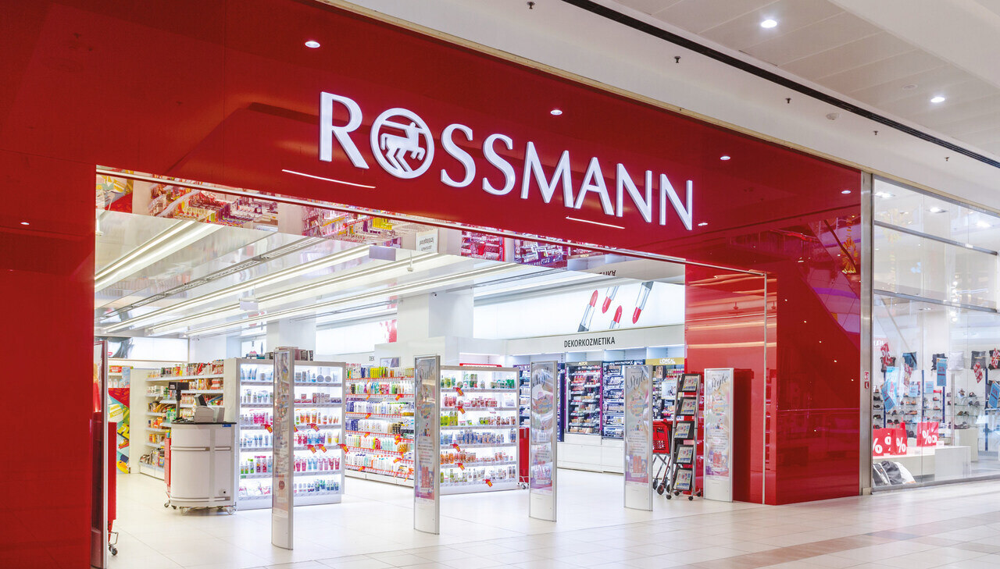
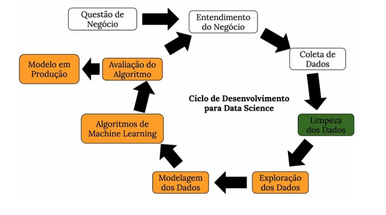
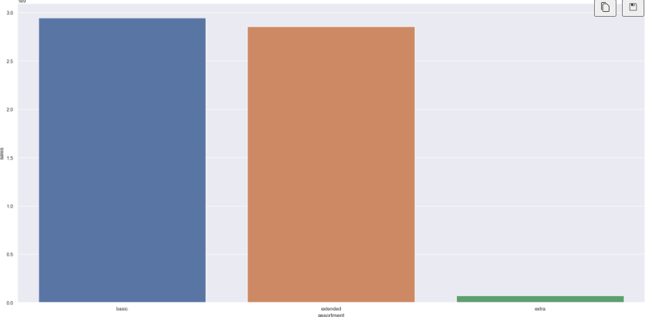
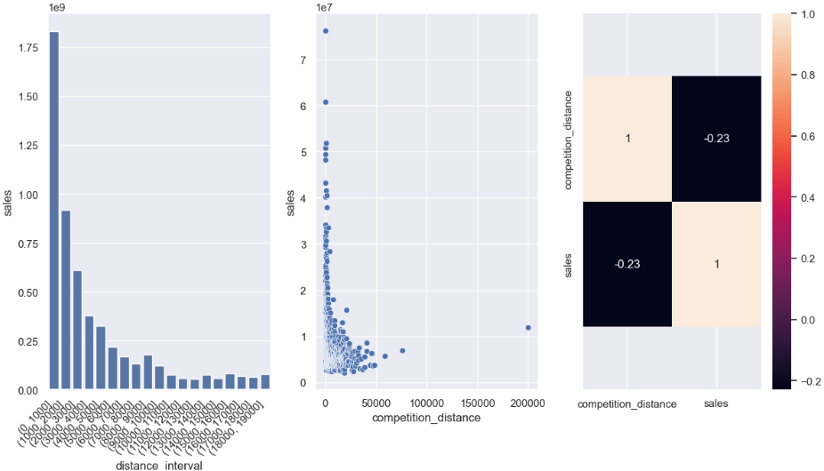
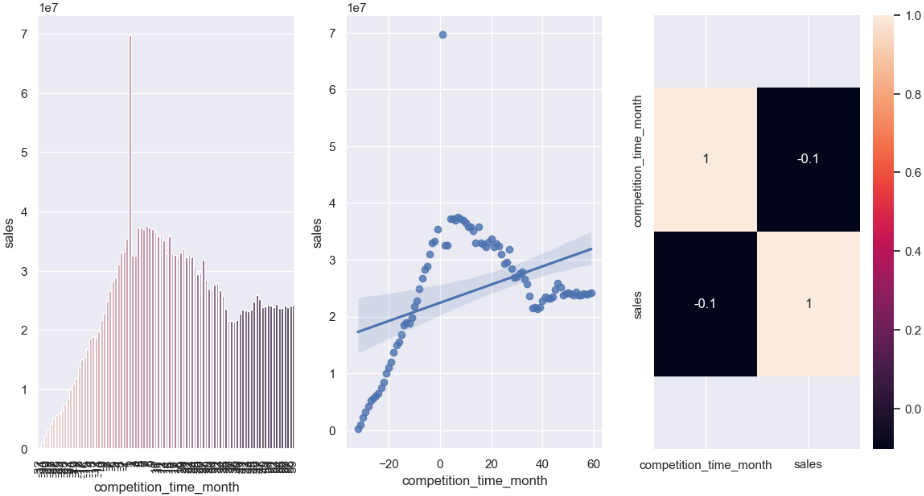
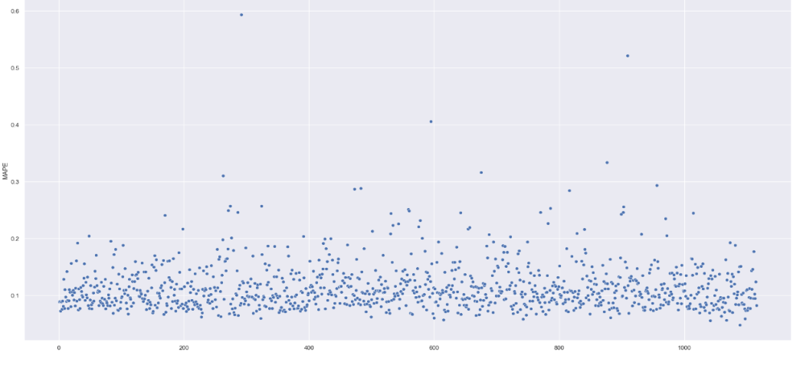

# Health Insurance Propensity Score

---

# 1. Business Problem

A Rossmann é uma empresa multinacional alemã do setor de varejo, especializada em produtos farmacêuticos, saúde, beleza, cuidados pessoais e bem-estar. Hoje, a empresa é uma das maiores redes de drogarias da Europa, com milhares de lojas espalhadas por diversos países. A Rossmann é conhecida por oferecer uma ampla variedade de produtos de qualidade a preços acessíveis. 

O contexto deste projeto é baseado em uma reunião da Rossmann, na qual o CFO da empresa fez uma solicitação de resultados mensais com todos os gerentes de loja e requisitou que cada um deles trouxesse uma previsão diária das próximas 6 semanas de vendas, a fim de obter um orçamento para realizar uma reforma nas lojas. Portanto, é de fundamental importância obter essa previsão nas vendas. Em seguida, os gerentes entraram em contato com o time de dados da empresa, solicitando uma previsão de vendas das lojas as quais gerenciam.

# 2. Business Assumption

As variáveis/atributos originais (e seus significados) do conjunto de dados são:

User
 Column                       | Description                                                                                      |
|------------------------------|-------------------------------------------------------------------------------------------------|
| Id                           | An ID representing a (Store, Date) tuple within the test set                                    |
| Store                        | A unique ID for each store                                                                      |
| Sales                        | Turnover for any given day (the prediction target)                                              |
| Customers                    | Number of customers on a given day                                                              |
| Open                         | Indicator for whether the store was open (0 = closed, 1 = open)                                 |
| StateHoliday                 | Indicates a state holiday: a = public holiday, b = Easter holiday, c = Christmas, 0 = None      |
| SchoolHoliday                | Indicates if the (Store, Date) was affected by the closure of public schools                    |
| StoreType                    | Differentiates between 4 different store models: a, b, c, d                                     |
| Assortment                   | Describes an assortment level: a = basic, b = extra, c = extended                               |
| CompetitionDistance          | Distance in meters to the nearest competitor store                                              |
| CompetitionOpenSince[Month]  | Approximate month of the time the nearest competitor was opened                                 |
| CompetitionOpenSince[Year]   | Approximate year of the time the nearest competitor was opened                                  |
| Promo                        | Indicates whether a store is running a promo on that day                                        |
| Promo2                       | Indicates if a store is participating in a consecutive promotion (0 = not participating, 1 = participating) |
| Promo2Since[Year/Week]       | Year and calendar week when the store started participating in Promo2                             |
| PromoInterval                | Consecutive intervals Promo2 is started, naming the months the promotion is started anew          |

# 3. Solution Strategy

  

Para este projeto, o método CRISP-DM foi utilizado, contando com os 10 passos abaixo:

**1. Problema de Negócio:** problema de negócio a ser resolvido;

**2. Entendimento do problema Negócio:** Entender a motivação, a causa e propor como será a estratégia de solução para este problema.

**3. Coleta de Dados:** os dados foram obtidos pelo Kaggle. (Rossmann Store Sales)

**4. Limpeza dos Dados:** consiste em renomear colunas, transformar as variáveis para seu tipo correto, verificar NA´s e preenchê-los quando houver, seguindo motivações do negócio, além de um breve resumo descritivo dos dados.

**5. Exploração dos Dados:** esta etapa busca analisar e compreender as variáveis que impactam a variável resposta do projeto. Também ocorre filtragem de variáveis, de acordo com a problemática de negócio. Aqui também são validadas as hipóteses de negócio com utilização de análise univariada, bivariada e multivariada, o que acarreta na geração de insights para o time de negócios.

**6. Modelagem dos Dados:** esta etapa é fundamental para enquadrar os dados nos aspectos principais para que foram enunciados os algoritmos de Machine Learning. Aqui são feitos a Normalização, Rescaling e Encoding, com objetivo de colocar os dados em uma mesma escala, além de transformar variáveis categóricas em variáveis numéricas.

**7. Seleção de Features:** esta etapa do projeto filtra as features mais relevantes para o treinamento de Machine Learning que vem a seguir. Não é interessante para o projeto ter um número muito grande de colunas que não impactam na explicação do problema estudado. 

**8. Machine Learning:** Em seguida, os dados preparados são treinados em diversos algoritmos de Machine Learning, a fim de obter o melhor modelo para explicar o fenômeno. Antes da escolha final, nesta etapa também é realizado o processo de Cross-Validation (validação cruzada) visando impedir que o modelo esteja enviesado, devio a uma separação específica para os dados de validação. Realizados esses procedimentos, aplica-se o Hyperparameter Fine Tuning para o modelo que apresentar melhor resultado, encontrando os melhores parâmetros para o algoritmo e maximizando ainda mais a performance do modelo.

**9. Avaliação do Algoritmo:** Aqui, avalia-se o algoritmo com os dados de teste previamente separados, de acordo com métricas alinhadas ao tipo de aprendizado dos modelos de Machine Learning. Ao final, a parte mais importante: traduzir a performance do algoritmo para resultados em termos de negócio e receitas para a empresa e mostrar a diferença, além do impacto que a utilização das técnicas trabalhadas aqui proporcionam para o desenvolvimento da empresa.

**10. Modelo em Produção:** Por fim, o modelo avaliado é publicação (Deploy) virtualmente (estrutura da solução abaixo) para que os resultados sejam utilizados por toda a equipe de negócio. Pra melhorar ainda mais esta visualização, um Bot no aplicativo Telegram traz, em tempo real, a predição para cada loja automatiamente.

# 4. Top 3 Insights 

### H1. Lojas com maior sortimentos deveriam vender mais.

  

FALSA. Na verdade, as lojas com maior sortimentos vendem menos. 

### H2. Lojas com competidores mais próximos deveriam vender menos.

  

FALSA. Os dados mostraram que as lojas com competidores mais próximos vendem mais.

### H3. Lojas com competidores a mais tempo deveriam vender mais.

  

FALSA. Lojas com competidores há mais tempo não vendem mais que a maioria das lojas com competidores há um tempo mediano. As lojas com competidores há muito pouco tempo, de fato, vendem menos.

# 5. Machine Learning Model Applied

Em seguida, após realizar a preparação dos dados, foram treinados 5 modelos de Aprendizado de Máquina com objetivo de encontrar o melhor algoritmo que descreva e explique o problema proposto:

- Average Model
- Linear Regression Model
- Linear Regression Regularized Model - Lasso
- Random Forest Regressor
- XGBoost Regressor

Os 5 algoritmos foram treinados e as métricas MAE, MAPE e RMSE. Aqui, nesta etapa também é realizado o processo de Cross-Validation (validação cruzada) visando impedir que o modelo esteja enviesado, devio a uma separação específica para os dados de validação. 

**MAE (Mean Absolute Error):** O MAE é uma métrica de avaliação comum para modelos de regressão que calcula a média das diferenças absolutas entre as previsões do modelo e os valores reais. Ele fornece uma medida da magnitude média dos erros no modelo, onde valores menores indicam uma melhor precisão do modelo.

**MAPE (Mean Absolute Percentage Error):** O MAPE é uma métrica de avaliação frequentemente utilizada em previsões de séries temporais e modelagem de demanda. Ele calcula a média das diferenças percentuais absolutas entre as previsões do modelo e os valores reais. O MAPE é útil para interpretar o erro do modelo em termos percentuais, permitindo uma compreensão melhor da precisão do modelo em relação à magnitude das observações.

**RMSE (Root Mean Squared Error):** O RMSE é uma métrica de avaliação comum em modelos de regressão que calcula a raiz quadrada da média dos quadrados das diferenças entre as previsões do modelo e os valores reais. O RMSE fornece uma medida da dispersão dos erros no modelo, onde valores menores indicam uma melhor precisão do modelo. Ele é sensível a grandes erros devido à natureza quadrática do cálculo.

Na tabela abaixo, o desempenho nessas métricas para os 5 modelos:

| Model Name               | MAE       | MAPE      | RMSE       |
|--------------------------|-----------|-----------|------------|
| Average Model            | 1354.800  | 0.455     | 1935.136   |
| Linear Regression        | 1863.859  | 0.286     | 2689.363   |
| Linear Regression - Lasso| 1891.705  | 0.289     | 2744.452   |
| RandomForestRegressor    | 1679.620  | 0.259     | 1676.594   |
| XGBoost Regressor        | 1410.884  | 0.204     | 1898.252   |

Apesar do modelo de Random Forest Regressor apresentar melhor desempenho, o modelo escolhido para prosseguimento e otimização dos hiperparâmetros (Hyperparameter Fine Tuning) foi o XGBoost Regressor. O processamento do XGBosst foi escolhido, por ser mais rápido e mais simples que a Random Forest, além de verificar que a diferença entre os RMSE dos dois modelos não foi tão relevante. 

**Performance Final**: após a utilização da técnica de Random Forest, na otimização dos Hyperparameter Fine Tuning, o modelo final apresentou as seguintes métricas de erro:

| Model Name               | MAE       | MAPE      | RMSE       |
|--------------------------|-----------|-----------|------------|
| XGBoost Regressor        | 770.95866 | 0.11464   | 1128.25570 |

# 6. Business Result 

Com isso e com as métricas de erro, foi possível prever o pior e melhor cenário para o somatório de vendas nas próximas seis semanas das lojas . Cada loja teve sua quantidade de vendas preditas e as 5 lojas com maior percentual de erro de predição são as lojas abaixo. Um percentual grande indica menos confiabilidade da predição naqueles valores gerados.

| store | predictions   | worst_scenario | best_scenario | MAE      | MAPE     |
|-------|---------------|----------------|---------------|----------|----------|
| 292   | 105178.210938 | 101742.646202  | 108613.775673 | 3435.564 | 0.593236 |
| 909   | 221617.890625 | 213716.453995  | 229519.327255 | 7901.437 | 0.521070 |
| 595   | 311628.218750 | 305747.549171  | 317508.888329 | 5880.670 | 0.405740 |
| 876   | 194406.109375 | 190272.654148  | 198539.564602 | 4133.455 | 0.333341 |
| 675   | 159330.921875 | 158379.094245  | 160282.749505 | 951.828  | 0.315899 |

Relação entre o erro MAPE com as respectivas lojas do dataset. Nota-se a presença de alguns outliers, como por exemplo a loja 292 (também registrada na tabela acima), que apresentou um MAPE muito maior em relação as demais:

  

Realizando-se a somatória de cada loja, em cada cenário, conseguimos chegar a uma predição de valor para receita final, considerando todas as lojas Rossmann Store:

| Scenario       | Values           |
|----------------|------------------|
| predictions    | U$283,857,088.00 |
| worst_scenario | U$282,994,540.68 |
| best_scenario  | U$284,719,621.56 |

# 7. Deploy do modelo

Para facilitar a consulta das predições para cada loja, por parte da equipe de negócios, foi desenvolvido um Bot no app Telegram. Basta salvar o contato do Bot e fazer as requisições na API, local em que a aplicação está hospedada. Foi utilizado o serviço em nuvem do Render.  

Abaixo, temos um vídeo rápido mostrando o funcionamento do Bot para algumas lojas. Atente-se que para lojas acima do número 1115, o bot fornece uma mensagem de erro, pois neste projeto trabalhamos apenas com as lojas de 1 a 1115. Atente-se também para o fato de que é necessário colocar uma "/" antes do número para que a requisição seja feita. 

Além disso, o bot avisará que uma loja não está disponível, quando for solicitado um número de loja ausente nos dados de teste utilizados neste projeto. Pra esses casos, a minoria, não foi possível realizar a predição.

Para o funcionamento do bot, é necessário aguardar aproximadamente 3 minutos após a primeira requisição, pois a aplicação entra em um modo de espero quando não está sendo utilizada. Portanto, este tempo é necessário para que ela seja "despertada". [Clique aqui](https://t.me/ross_project_bot) para acessar o RossmanBot

  

# 8. Conclusions

- Com as predições realizadas, a Rossmann tem informações suficientes para tomada de decisões a respeito da realização da reforma pretendida. O CFO tem em mãos quais lojas são mais ou menos confiáveis em termos da predição, de acordo com os erros apresentados acima. 

- Outras medidas podem ser adotadas como uma melhor preparação de estoque para lojas com previsão de alta receita, campanhas de marketing ou promoções específicas para lojas com previsão de baixa receita.

# 9. Lessons Learned e Next Steps 

Em projetos seguintes, além do que já foi feito, podem ser incrementados:

- Testar outros algoritmos de Machine Learning
- Trabalhar com outras features em outros ciclos do CRISP
- Utilizar outra estratégia para Fine Tuning Hyperparameter
- Criar outras opções de comunicação no chat do Bot Telegram

# 10. References

- Foto capa: [Daily News Hungary](https://dailynewshungary.com/another-shopping-chain-to-be-closed-on-24-december-in-hungary/)
- Datasets: [Kaggle](https://www.kaggle.com/competitions/rossmann-store-sales)

